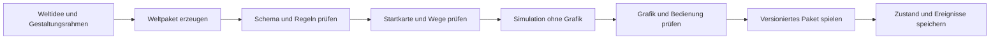

# RealmCraft, Implementierungsplan für das Echtzeitspiel

## Ziel und Geltungsumfang

RealmCraft wird als Echtzeitstrategiespiel für den Browser weiterentwickelt. Eine kleine Gruppe errichtet eine Siedlung, organisiert Arbeit und Versorgung, gewinnt neue Mitglieder und entwickelt Technologien. Nachbarn können Handelspartner, Verbündete oder Gegner werden. Verteidigung und offensiver Krieg gehören zum Zielspiel. Friedlicher Aufbau besitzt eigene Lösungen für Umweltprobleme, Handelsinteressen und gesellschaftliche Konflikte.

Die Neuausrichtung wurde am 9. September 2026 ausdrücklich vom Nutzer festgelegt. Sie ersetzt die frühere Entscheidung für Rundenstrategie. Die folgende Systemgestaltung und die Zahlen des ersten Ausschnitts sind Umsetzungsvorschläge. Dieser Auftrag liefert den Plan und seine kanonische Einordnung. Eine Echtzeitlaufzeit ist noch nicht implementiert.

Neue Partien sollen unterschiedliche Welten, Level, Regelkonstellationen und Gestaltungen erhalten. Ein erzeugtes Weltpaket wird vor dem Spiel geprüft und gespeichert. Die laufende Simulation benötigt keine Modellantwort. Die Erzeugung zusätzlicher Inhalte kann über das AI Harness erfolgen; ihr Einbau geschieht an einem ausdrücklichen Lade- oder Versionswechsel.

## Spielmodell

### Eine bewohnte Siedlung

Die Welt wird zunächst in einer zweidimensionalen Aufsicht dargestellt. Figuren bewegen sich zwischen Wohnort, Lager, Rohstoffquelle und Arbeitsplatz. Der Spieler setzt Bauplätze, organisiert Berufskapazitäten und verändert Prioritäten. Transporte und Baufortschritt sind räumlich sichtbar. Der Mauszeiger bleibt auf der Welt; ausführliche Informationen öffnen sich bei Auswahl.

Bewohner besitzen eine stabile Identität, eine Tätigkeit und wenige wirksame Eigenschaften. Nahrung, Unterkunft, Erholung und Sicherheit beeinflussen ihre Verfügbarkeit. Fähigkeiten verändern die Eignung für Arbeit und Forschung. Die erste Fassung verwendet einfache Tagesabläufe. Einzelne Figuren erhalten besondere Aufmerksamkeit durch ihre Geschichte oder Rolle; ein vollständiges Beziehungsnetz ist kein Einstiegserfordernis.

Gruppen schließen sich aufgrund von Aufnahmeentscheidungen, Aussicht auf Versorgung, Schutz oder gemeinsamen Interessen an. Ihre Mitglieder erscheinen als dieselben Personen in Arbeit, Bedarf und gegebenenfalls Wehrdienst. Ein Zuzug erzeugt gleichzeitig neue Möglichkeiten und zusätzliche Versorgungspflichten. Er darf bei erneutem Laden oder wiederholtem Bestätigen nicht ein zweites Mal auftreten.

### Wirtschaft und Bau

Rohstoffe liegen an konkreten Orten. Ein Arbeitsauftrag erzeugt Waren erst nach Arbeit und Transport. Lager, Träger und Wege begrenzen die verfügbare Versorgung. Bauplätze benötigen eine gültige Fläche, erreichbaren Zugang, Materiallieferung und Bauarbeit. Ein fertiggestelltes Gebäude eröffnet seine Funktion.

Die erste Logistik verwendet wenige Warentypen und einen gemeinsamen Bestand mit ausgewiesenen Reservierungen. Ein reservierter Bestand ist für andere Aufträge gesperrt. Lieferungen bewegen Material in einen Baustellenbestand. Abbruch gibt unverbautes Material zurück; bereits eingesetzte Mengen folgen einer definierten Rückbauregel. Nahrung wird nur beim tatsächlichen Verbrauch abgebucht. Abgelehnte oder doppelte Befehle verändern keine Bestände.

Der Spieler stellt für Gebäude Zielbesetzung und Priorität ein. Bewohner suchen passende, erreichbare Aufgaben selbstständig. Ein direkter Arbeits- oder Bewegungsbefehl kann diese Auswahl begründet übersteuern. Ein sichtbarer Zustand erklärt fehlenden Zugang, Materialmangel, eine unbesetzte Stelle oder einen politischen Vorbehalt.

### Forschung und Institutionen

Forschung benötigt qualifizierte Personen, einen geeigneten Arbeitsplatz, Arbeitsfortschritt und gegebenenfalls Materialien. Wer forscht, fehlt in der laufenden Produktion. Technologien eröffnen Verfahren, Gebäude, Ausrüstung oder neue Organisationsformen. Ein Forschungsbaum muss erreichbare Voraussetzungen besitzen und darf keine verborgenen Kreise enthalten.

Der RealmCraft-Kern liegt in den dauerhaften Folgen gesellschaftlicher Entscheidungen. Eine Aufnahme kann ein neues Handwerk ermöglichen und Mitspracherechte begründen. Eine Wehrordnung kann Truppen mobilisieren und die verfügbare Arbeit reduzieren. Eine Handelskonzession kann Versorgung sichern und Zugänge oder Preise binden. Eine beschlossene Institution besitzt Geltungsbereich, Bedingungen, Wirkungen, Änderungsverfahren und einen Eintrag in der Chronik.

Loyalität gegenüber der Führung und Zustimmung zu einem bestimmten Vorhaben bleiben unterscheidbar. Die Simulation prüft Verpflichtungen bei jedem betroffenen Auftrag. Politische Entscheidungen besitzen einen ausdrücklichen Wirksamkeitszeitpunkt. Eine Verfassungsänderung löscht frühere Ursachen und Folgen nicht.

### Ereignisse, Handel und Krieg

Ereignisse entstehen aus Zustandsbedingungen, regionalen Entwicklungen und einem reproduzierbaren Ereignisplan. Möglichkeiten sind Zuzug, Dürre, ein Handelsangebot, eine Entdeckung, ein Arbeitskonflikt oder ein Überfall. Prioritäten, Abklingzeiten und wechselseitige Ausschlüsse verhindern ständig unterbrechende Meldungen. Warnungen erscheinen möglichst am betroffenen Ort. Eine größere politische Entscheidung kann die Partie nach einer sichtbaren Einstellung pausieren.

Nachbarn verfügen über eigene Ziele, Bestände und Informationen. Handel braucht Waren, Zugang und die Möglichkeit, vereinbarte Leistungen tatsächlich zu liefern. Geschäftskonflikte können aus knappen Gütern, Zöllen, Vertragsbruch oder konkurrierenden Ansprüchen entstehen. Verhandlung, alternative Lieferwege und Eigenproduktion müssen spielbare Antworten sein.

Verteidigung verwendet Alarm, Sammelpunkt und Schutzaufträge. Offensive Befehle umfassen Bewegung, Angriff und Rückzug; kleine Verbände können später Formationen erhalten. Kämpfende Personen werden aus der Bevölkerung rekrutiert und ausgerüstet. Verluste, Verwundungen und längere Abwesenheit wirken auf Wirtschaft und Zusammenhalt zurück. Eine regelmäßige Rohstoffprämie für Gewalt ist keine allgemeine Fortschrittsregel.

Zum ersten vollständigen Szenario gehören ein friedlicher und ein militärischer Lösungsweg für denselben äußeren Konflikt. Ein Erfolg kann durch tragfähige Versorgung, eine politische Einigung oder die Sicherung eines Zugangs entstehen. Wirtschaftlicher Ausbau darf ohne Angriffskrieg erfolgreich sein. Gleichwertigkeit und Ausnutzbarkeit dieser Wege benötigen gesonderte Spieltests.

## Technische Grundlage

### Browser als Hauptplattform

Empfohlen ist TypeScript mit Vite und Phaser. TypeScript macht Zustände und Befehle prüfbar; Vite bündelt Anwendung und Ressourcen. Phaser übernimmt die grafische Szene, Kamera, Eingabe, Animationen und Audio. Es besitzt dafür integrierte Systeme und ein offizielles Vite-/TypeScript-Template. Diese vorhandenen Spielfunktionen passen zum erweiterten Echtzeitauftrag. [Phaser-Szenen](https://docs.phaser.io/phaser/concepts/scenes), [offizielles Template](https://github.com/phaserjs/template-vite-ts)

Die frühere PixiJS-Empfehlung bezog sich auf eine bewegliche Weltansicht. PixiJS bleibt eine geeignete Darstellungsbibliothek. Für den jetzt beschriebenen Funktionsumfang würde ein größerer Teil der Spielinfrastruktur selbst entstehen. Die Empfehlung für Phaser ist eine Architekturentscheidung aus den Anforderungen; ein Leistungsvergleich im RealmCraft-Prototyp liegt noch nicht vor.

Die Simulation bleibt von Phaser getrennt und verwendet keine Browserobjekte. Bedienung und Grafik übergeben Befehle und lesen Zustände. Physik, Kamerabewegung und Animation dürfen keine wirtschaftlichen Ergebnisse bestimmen. Für das erste Siedlungsmodell genügen ein Belegungsraster, Pfadsuche und einfache Bewegungsregeln. Ein allgemeines Framework für alle denkbaren Spieltypen ist kein vorgelagertes Arbeitspaket.

Lesefenster, Einstellungen und zugängliche Bedienalternativen verwenden semantisches HTML über der Spielszene. Canvas-Aktionen bekommen Tastaturzugänge. Ein separates UI-Framework wird erst bei einem konkreten Bedarf ergänzt. Bibliotheken und Assets werden mit der Anwendung ausgeliefert; die Partie benötigt kein öffentliches CDN.

### Spielzeit und Reproduzierbarkeit

Der vorgeschlagene Einstieg verwendet feste Simulationsschritte von 100 Millisekunden. Die Grafik zeichnet unabhängig davon und interpoliert Bewegungen zwischen bekannten Zuständen. Spieltempo verändert die Anzahl der Simulationsschritte. Pause hält die Spielzeit an und erlaubt das Vorbereiten von Aufträgen. Diese Werte sind zu prüfende Startparameter.

Jeder Befehl erhält eine eindeutige Kennung, einen Zielschritt und eine stabile Reihenfolge. Zufallszahlen stammen aus gespeicherten, gesetzten Generatorzuständen. Mengen werden in ganzen Basiseinheiten berechnet. Ein Prüflauf muss aus demselben Weltpaket, Startzustand und denselben Befehlen den gleichen Zustand erzeugen. Die erste Zusage gilt für dieselbe Laufzeitversion; browserübergreifende Gleichheit wird explizit verglichen.

Bei verdecktem Tab pausiert die Einzelspielerpartie. Zurückkehren erzeugt keine nachträgliche Aufholsimulation. Das berücksichtigt, dass Browser Hintergrund-Timer und Zeichenschleifen drosseln. [Page Visibility API](https://developer.mozilla.org/en-US/docs/Web/API/Page_Visibility_API)

Pfadsuche wird nach veränderten Zielen oder blockierten Wegen neu angestoßen. Ein räumlicher Index beschränkt lokale Nachbarschaftsabfragen. Ein Web Worker wird erst eingesetzt, wenn Messungen eine blockierende Berechnung zeigen. Die unabhängige Simulationsschnittstelle ermöglicht diese Auslagerung später.

### Speicherung

Ein Echtzeitspiel benötigt einen vollständigen Zustandsstand mit Spielschritt, Bewohnern, Reservierungen, laufenden Aufgaben, Transporten, Forschung, Ereignissen und Zufallszuständen. Er verweist auf das genaue Weltpaket und dessen Version. Ein begrenztes Befehlsprotokoll unterstützt Reproduktion und Fehlersuche. Der bestehende Nachtmeer-Speicher mit sechs ausgeführten Zügen wird nicht als Echtzeitformat weitergeführt.

IndexedDB ist für strukturierte lokale Daten und größere Weltpakete vorgesehen. Export und Import erhalten einen vollständigen, versionierten Spielstand. Fehlerhafte oder inkompatible Dateien ersetzen keine laufende Partie. Ein geladenes Weltpaket bleibt für bestehende Speicherstände verfügbar. [IndexedDB](https://developer.mozilla.org/en-US/docs/Web/API/IndexedDB_API)

Ein installierbarer Offlinezugang kann später über einen Service Worker ergänzt werden. Desktop-Verpackung bleibt eine mögliche Erweiterung. Weder Tauri noch eine native Engine sind Voraussetzung des Browserplans. Mehrspielerbetrieb benötigt zusätzliche Synchronisationsregeln und liegt außerhalb der ersten vollständigen Fassung.

## Erzeugung neuer Partien

### Zwei Ebenen der Variation

Ein gesetzter Startwert, der Seed, erzeugt innerhalb eines vorhandenen Weltpakets neue Karten und Ausgangslagen. Gelände, Rohstoffverteilung, Nachbarpositionen und Ereigniskonstellationen verändern die nötigen Entscheidungen. Die Erzeugung und Prüfung laufen im Browser.

Ein neues Weltpaket kann darüber hinaus Gesellschaften, Rezepte, Technologien, Ereignisse, Institutionen und die gesamte Bildsprache verändern. Das Harness erzeugt diese Definitionen und die dazugehörigen Assets vor dem Spiel. Eine Generatorversion, der Seed und das geprüfte Paket werden gemeinsam gespeichert. Ein Seed allein reproduziert keine beliebige Modellgenerierung.

### Inhalt eines Weltpakets

| Bestandteil | Funktion | Erforderliche Prüfung |
|---|---|---|
| Metadaten und Versionen | Identität, kompatible Regelversion, Herkunft und Reproduktion | Pflichtangaben, bekannte Formate und stabile Kennungen |
| Welt- und Leveldefinition | Gelände, Bauflächen, Wege, Ressourcen, Startgruppe und Nachbarn | Erreichbarer Start, ausreichende Grundressourcen, gültige Plätze |
| Gebäude und Tätigkeiten | Baukosten, Arbeitsplätze, Rezepte und Transporte | Bilanzkonsistenz, gültige Verweise, keine kostenlose Ressourcenvermehrung |
| Technologie | Voraussetzungen, Arbeitsbedarf und freigeschaltete Fähigkeiten | Erreichbarkeit, keine Zyklen, tatsächliche Wirkung |
| Ereignisse und Institutionen | Bedingungen, Optionen, Folgen und fortgeltende Regeln | Zulässige Wirkungen, begrenzte Wiederholung, nachvollziehbare Verpflichtungen |
| Gestaltung | Gelände- und Gebäudebilder, Figuren, Icons, Schrift, Palette und Audio | Vollständige Zustände, erkennbare Funktionen, Lesbarkeit, geeignete Assetgrößen |

Die erste Erzeugung verwendet definierte Regelbausteine. Ein Paket kann beispielsweise Warentypen, Arbeitsabläufe, Vorratsgrenzen oder diplomatische Bedingungen kombinieren. Beliebiger ausführbarer Modellcode gehört nicht zum Importformat. Eine neue Mechanik außerhalb der unterstützten Bausteine wird als Entwicklungsänderung mit eigenen Prüfungen integriert und erhält eine neue Regelversion.

Ein konsistenter Gestaltungssatz benötigt gemeinsame Maßstäbe, Perspektive, Beleuchtung, Konturen und Symbolbedeutungen. Gebäude brauchen mindestens Bauplatz, im Bau, aktiv und beschädigt als unterscheidbare Zustände. Einzelne Bilder werden nach einer gemeinsamen Gestaltungsvorgabe erzeugt und als wiederverwendbare Assets aufbereitet. Neue Namen und Farben allein erfüllen das Ziel neuer Spielwelten nicht.

### Prüfbarer Erzeugungsweg

Ungültige Pakete werden mit konkretem Befund an die Erzeugung zurückgegeben. Erst ein geprüftes Paket wird spielbar geladen. Ein fehlgeschlagener Erzeugungsversuch lässt bestehende Partien und Pakete verfügbar. Die spätere Integration externer Modellzugänge erhält einen eigenen Erzeugungsdienst oder nutzt das vorhandene Harness; Zugangsschlüssel gehören nicht in den ausgelieferten Spielclient.

## Professionelle Spieloberfläche

Die [User Stories und Abnahmekriterien](RealmCraft-User-Stories.md) sind für die Umsetzung maßgeblich. US16 und US17 gelten ab der ersten Spielszene. Die Nutzerkritik verlangt eine deutlich ästhetischere Gestaltung und eine erneute Prüfung der tatsächlich erfüllten Spielerabsichten. Die Kartenkammer ist keine gestalterisch abgenommene Vorlage.

Die Welt füllt die verfügbare Spielfläche. Kamera, Auswahl und Bauvorschau arbeiten im selben Koordinatensystem. Eine kompakte Ressourcenanzeige bleibt am oberen Rand. Kontextaktionen erscheinen an der Auswahl oder in einer kleinen Aktionsfläche. Nachrichten bilden eine aufrufbare Ereignisliste. Lange Chronik- und Forschungstexte öffnen sich bei Bedarf.

Linien markieren tatsächliche Verbindungen, Grenzen, Reichweiten oder Fortschritt. Die Gliederung von Bedienflächen nutzt Position und Abstand. Ein großes Markenbanner, eine Seitennavigation und dauerhafte Dokumentabschnitte gehören nicht in die laufende Spielansicht.

Ressourcen, Aufgaben und Probleme besitzen erkennbare Symbole mit ergänzenden Zahlen oder kurzen Zustandswörtern. Eine fehlende Lieferung wird am betroffenen Bauplatz angezeigt. Erklärungen sind per Zeigerkontakt, Fokus oder Auswahl erreichbar. Eine alternative Objektliste ermöglicht die Auswahl per Tastatur. Reduzierte Bewegung, pausierbare Meldungen, skalierbare Schrift und Fokusführung gehören zum Bedienungsumfang.

Das Interface behält stabile Bedeutungen und Bedienhandlungen. Seine grafische Ausarbeitung darf sich mit dem Weltpaket ändern. Die maritime Kartenkammer bleibt ein Referenzfall für Zustand und politische Herkunft. Ihr Papierstil ist keine generelle Vorgabe für RealmCraft.

## Umsetzung in prüfbaren Abschnitten

Die Reihenfolge folgt funktionalen Abhängigkeiten. Sie enthält keine Termin- oder Aufwandsschätzung. Jeder Abschnitt führt zu einem ausführbaren Ergebnis. Ein Bereich zählt erst nach den genannten Prüfungen als umgesetzt.

| Abschnitt | Ausführbares Ergebnis | Abschlusskriterium |
|---|---|---|
| E1 Bewohnte Siedlung | Eine kleine Gemeinschaft baut, arbeitet, transportiert, nimmt Menschen auf und erforscht ein Verfahren | Der zusammenhängende Beispielsablauf unten funktioniert einschließlich Pause und Fortsetzung |
| E2 Gesellschaft und Entwicklung | Technologiepfade, wirksame Institutionen, Berufe und situationsabhängige Ereignisse | Verschiedene Organisationsentscheidungen verändern Versorgung und spätere Möglichkeiten; Ursachen bleiben auffindbar |
| E3 Nachbarn und Konflikte | Handel, Verträge, Umwelt- und Geschäftskonflikte, Verteidigung und offensive Befehle | Derselbe Ausgangskonflikt ist friedlich und militärisch spielbar; Verluste und Vereinbarungen wirken dauerhaft |
| E4 Wiederholbar neue Welten | Zwei unterschiedliche Weltpakete und Kartenvariation über Seeds | Beide laufen mit derselben Laufzeit; Start und Ziele sind erreichbar; die Pakete unterscheiden sich mechanisch und gestalterisch |
| E5 Erzeugung und belastbarer Browserbetrieb | Harness-Erzeugung geprüfter Pakete, vollständige Fortsetzung und geprüfte Bedienung | Ein weiteres Paket entsteht über denselben Erzeugungsweg; Fehlerfälle, Leistung und Bedienbarkeit bestehen die vereinbarten Prüfungen |

Verteidigung, offensiver Krieg und friedliche Entwicklung gehören verbindlich in E3. Ihre spätere Integration ist über Bevölkerung, Logistik und Befehle vorbereitet. E1 allein erfüllt das gesamte Spielziel ausdrücklich noch nicht.

## Nächster Milestone E1, bewohnte Siedlung

### Konkreter Umfang

Vorgeschlagen sind eine Karte mit 64 × 64 Feldern und zwölf Bewohnern zu Beginn. Der technische Prüffall soll mindestens 40 aktive Bewohner tragen. Ressourcen sind zunächst Nahrung, Holz und Stein. Personenfähigkeiten und Forschungsfortschritt sind eigene Zustände. Diese Zahlen begrenzen den ersten Nachweis und müssen anschließend spielerisch abgestimmt werden.

Gebäudefunktionen sind Gemeinschaftshaus, Unterkunft, Lager, Nahrungsgewinnung, Holzgewinnung, Steinbruch und Werkstatt. Eine passende Startgruppe und Grundversorgung ermöglichen den Einstieg. Der erste Bau benötigt echte Lieferung und Bauarbeit. Eine Aufnahmeentscheidung bringt vier neue Menschen und ihre Bedarfe. Eine Forschungsentscheidung verbessert ein vorhandenes Verfahren. Ein Versorgungspakt begrenzt weitere Bauaufträge zugunsten einer Reserve. Ein angekündigtes Umweltproblem verlangt eine konkrete Reaktion.

### Zusammenhängender Prüffall

1. Der Spieler erkundet die Startfläche mit Kamera und Auswahl. Personen sind ansprechbare Objekte und besitzen eine erkennbare Tätigkeit.
2. Er weist Arbeit auf Nahrung und Holz zu. Bewohner erreichen die Quellen und bringen Waren ins Lager.
3. Er setzt eine Unterkunft. Bauvorschau, Reservierung, Lieferung, Baufortschritt und Bezug funktionieren nacheinander.
4. Eine Gruppe erreicht die Siedlung. Aufnahme verändert Bevölkerung, verfügbare Arbeit, Wohnraum und Verbrauch genau einmal.
5. Der Spieler besetzt die Werkstatt und entwickelt ein Verfahren. Die Bindung der Arbeitskräfte ist sichtbar; nach Abschluss verändert sich eine reale Produktionseigenschaft.
6. Ein angekündigter Versorgungsdruck löst eine politische Entscheidung aus. Der gewählte Versorgungspakt gilt für den nächsten betroffenen Bau und erscheint in der Chronik.
7. Pause, Geschwindigkeit, Speichern und Laden erhalten alle begonnenen Tätigkeiten. Eine Versorgungskrise besitzt eine erklärte Folge und einen möglichen Gegenbefehl.

### Implementierungsfolge innerhalb von E1

| Arbeit | Dateien im vorgeschlagenen neuen Bereich | Nachweis |
|---|---|---|
| Vite-/TypeScript-Einstieg und Spielszene | `rts/package.json`, `rts/index.html`, `rts/src/main.ts`, `rts/src/view/` | Produktionsbuild lädt Szene und lokal gebündelte Assets; Kamera und Auswahl funktionieren |
| Unabhängiger Simulationskern und Befehle | `rts/src/sim/`, `rts/src/content/` | Zeit, Reihenfolge und gültige Zustandsübergänge ohne Grafik prüfbar |
| Gelände, Gebäudeplätze und Bewegung | `rts/src/sim/world/`, `rts/src/view/world/` | Erreichbarkeit, blockierte Flächen und Wegeverlust behandelt |
| Tätigkeiten, Lager und Baustellen | `rts/src/sim/jobs/`, `rts/src/sim/economy/` | Keine doppelten Reservierungen; sichtbare Lieferung und abgeschlossener Bau |
| Zuzug, Forschung, Versorgungspakt | `rts/src/sim/population/`, `rts/src/sim/rules/` | Der zusammenhängende Entscheidungsfall verändert dieselbe simulierte Gemeinschaft |
| Zustandsstand und Wiederherstellung | `rts/src/storage/` | Fortsetzung während Transport, Bau, Forschung und offener Entscheidung |
| Browserprüfung und technische Evidenz | `rts/tests/`, Ergänzung in diesem Dokument | Einheitliche Funktions- und Leistungsbelege für den erreichten Umfang |

E1 startet mit einem von Hand definierten Weltpaket. Sein Format berücksichtigt bereits weitere Welten. Die automatische Erzeugung erhält erst mit einer zuverlässig spielbaren Referenz sinnvolle Prüfkriterien.

## Verifikation und fachliche Validierung

| Ebene | Zu prüfende Aussage |
|---|---|
| Regeltests | Kosten, Reservierungen, Produktion, Zuzug und Institutionswirkungen erzeugen genau die zulässigen Folgen |
| Reproduktion | Gleicher Zustand, gleiche Generatorzustände und gleiche Befehlsfolge ergeben dieselben Ergebnisse; Grafiktempo beeinflusst sie nicht |
| Pfad- und Arbeitsprüfung | Unerreichbare Aufgaben, neue Hindernisse und fehlende Waren blockieren erklärbar und können wieder aufgenommen werden |
| Speicherprüfung | Fortsetzung während aller langlebigen Tätigkeiten entspricht dem ununterbrochenen Lauf |
| Browserbedienung | Bau, Auswahl, Pause, Tempo, Forschung und Entscheidungen sind sichtbar ausführbar; Tastatur und Fokus funktionieren |
| Leistung | E1 wird mit 40 Bewohnern, der Startkarte und parallelen Tätigkeiten auf dokumentierter Hardware vermessen; späterer Belastungsfall mit 100 Bewohnern |
| Welterzeugung | Ein vorab festgelegter Satz von beispielsweise 50 Seeds je Referenzpaket hat erreichbare Starts und benötigte Grundressourcen; ungültige Pakete scheitern mit Befund |
| Spielqualität | Der Nutzer versteht die Arbeitsorganisation, erlebt sinnvolle Zielkonflikte und kann friedliche wie militärische Wege begründet wählen |

Als anfängliches Leistungsziel gelten eine gleichmäßig bedienbare Darstellung mit ungefähr 60 Bildern pro Sekunde und ein 95. Perzentil unter zehn Millisekunden je Simulationsschritt im E1-Prüffall. Hardware, Browser, Auflösung und Last werden im Bericht genannt. Dies sind Zielwerte und noch keine Messungen. Ein Erstaufbau darf keine überladenen Render- oder Simulationsarchitekturen allein zur Absicherung größerer hypothetischer Welten einführen.

Automatisierte Harness-Läufe können Startfehler, wirtschaftliche Sackgassen, Regelverletzungen und reproduzierbare Strategien finden. Erreichbarkeit in solchen Läufen belegt keine ausgeglichene Wirtschaft. Verständlichkeit, Tempo, gestalterische Qualität und die Bedeutung von Entscheidungen benötigen beobachtete Spieltests.

## Umgang mit dem vorhandenen Repository

Der neue Bereich `rts/` erhält seinen eigenen Build. Das bestehende Dashboard, die Nachtmeer-Partie und der Winter-Prototyp bleiben über ihre bisherigen Einstiege erreichbar. Der aktuelle Server auf Port 4190 bleibt für diese Referenzen nutzbar. Die Echtzeitentwicklung erhält beim Aufbau einen eigenen, auf Verfügbarkeit geprüften Entwicklungsport; der Produktionsbuild wird als statische Anwendung ausgeliefert.

Übernommen werden das Prinzip gültiger Befehle, die Trennung von Vorschau und Wirkung, erklärbare Institutionen und die Prüfung von Speicherständen. Szenariospezifische Namen und Sonderfälle werden nicht in den allgemeinen Kern kopiert. Der neue Speicherpfad bleibt von den bestehenden Partien getrennt.

`knowledge/` und `savegame.json` bleiben Eigentum der Spielleitung. Entwicklungswissen liegt unter `docs/`; konzeptioneller Pflegeort ist im Vault `RealmCraft Game Design`, die Gestaltung liegt in `RealmCraft Interface Design`. ACTIVE-WORK führt das Echtzeitziel und den nächsten ausführbaren Abschnitt. Der aktuelle E1-Stand ist geplant.
